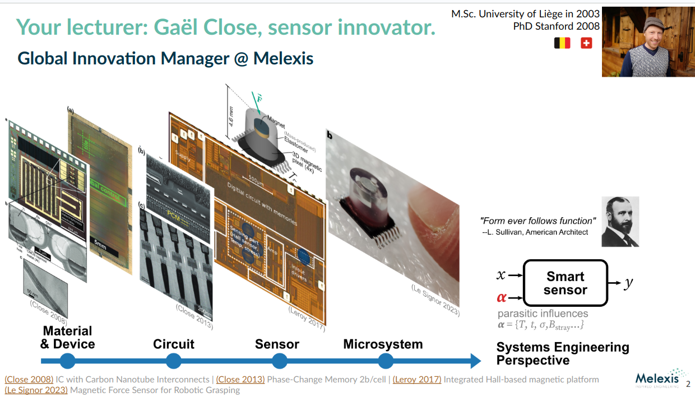

Gaël Close (M’03-SM'18) received the M.S degree in electrical engineering from the University of Liège, Liège, Belgium, in 2003 and the Ph.D. degree in electrical engineering from Stanford University, Stanford, California, in 2008, respectively. From 2008 to 2011, he was with IBM Research—Zurich, Switzerland, developing phase-change memory chips. Since 2011, he has been with Melexis, Bevaix, Switzerland. For 8 years, he was in charge of the architectural definition of automotive magnetic sensors. These sensors are now deployed in high-volume applications. -->

Since 2021, he has been in charge of the innovation effort beyond the core automotive market at Melexis. He leads an engineering team that develops novel sensors for emerging applications (robotics, wearable devices). His team was a finalist for the *Electra Awards 2022, Design Team of the Year.* In addition to technology pre-development, product discovery and hands-on electronics design, he has a keen interest in constantly expanding his toolbox of engineering and management methods—in particular system modeling, prototyping, lean product development, and data science.

He has published about 40 peer-reviewed publications in international journals and conferences, covering nano-electronic devices, circuit/system design, sensor product and prototype development. He holds 15 patents with another dozen pending, and is a IASCC Six Sigma Black Belt (2017).

📎 [CV in pdf](assets/gael-close-cv.pdf)


# Track record



# Social profiles

```{=html}
<div style="margin-top: 20px; padding: 20px; background-color: #f8f9fa; border-radius: 8px;">
  <a href="https://www.linkedin.com/in/gael-close-4345a926" style="margin-right: 20px; text-decoration: none; font-size: 28px;">
    <i class="fab fa-linkedin" style="color: #0A66C2;"></i>
  </a>
  <a href="https://github.com/gael-close" style="margin-right: 20px; text-decoration: none; font-size: 28px;">
    <i class="fab fa-github" style="color: #333;"></i>
  </a>
  <a href="https://orcid.org/0000-0002-5140-7789" style="margin-right: 20px; text-decoration: none; font-size: 28px;">
    <i class="fab fa-orcid" style="color: #A6CE39;"></i>
  </a>
  <a href="https://scholar.google.ch/citations?user=xebSVGIAAAAJ" style="text-decoration: none; font-size: 28px;">
    <i class="fab fa-google" style="color: #4285F4;"></i>
  </a>
</div>
```
